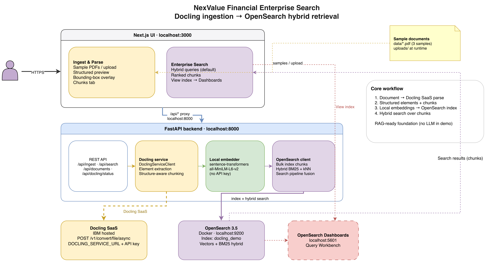
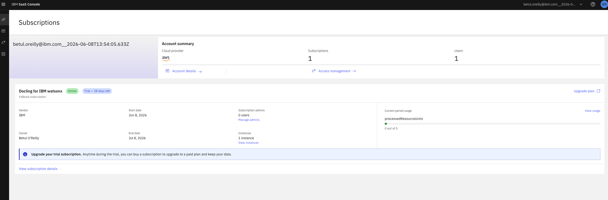
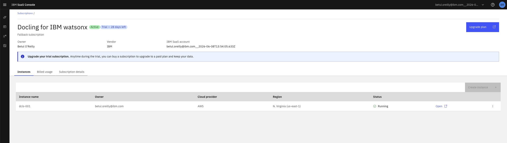
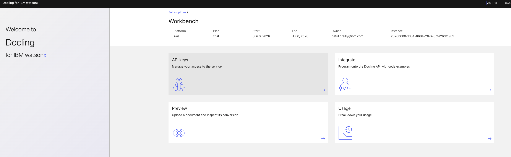
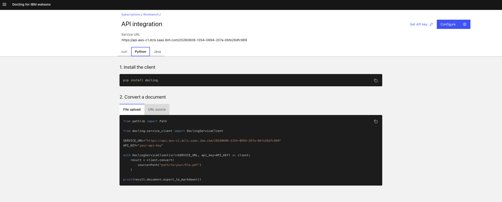

# Parse Complex Policy PDFs with Docling SaaS and Search Them with OpenSearch Hybrid Retrieval

**Build a full-stack enterprise search demo: Docling SaaS for layout-aware parsing, local embeddings, and OpenSearch for keyword, semantic, and hybrid retrieval over structured document chunks.**

---

## Introduction

Enterprise policy knowledge often lives in PDFs, scanned forms, and tables. Plain text extraction flattens layout, breaks tables, and skips image-only pages. Keyword search then struggles when employees ask questions in natural language or use different wording than the original document.

In this tutorial you build **NexValue Financial Enterprise Search**, a developer demo that connects two layers:

1. **IBM Docling SaaS** parses complex documents into a structured `DoclingDocument` with reading order, classified elements, tables, OCR output, and page provenance.
2. **OpenSearch 3.5** indexes Docling chunks with locally generated embeddings and serves keyword, semantic, and hybrid search.

You will run a **Next.js** UI and **FastAPI** backend locally, parse sample compliance documents, inspect what Docling extracted, and search the indexed chunks. There is **no LLM chat layer** in this demo. The output is a search-ready knowledge layer: structured chunks with metadata that you could pass to a RAG pipeline later.


**End-to-end flow:**

`Documents → Docling SaaS → structured elements + chunks → local embeddings → OpenSearch → hybrid search`

---

## What you will build

By following this tutorial you will have a working local stack:

| Component | What it does in this demo |
|-----------|---------------------------|
| **Next.js UI** (port 3000) | Upload or select documents, preview Docling extraction, run enterprise search |
| **FastAPI backend** (port 8000) | Calls Docling SaaS, builds chunks, generates embeddings, indexes and queries OpenSearch |
| **Docling SaaS** | Parses PDFs and images into layout-aware structured output |
| **Local embeddings** | `sentence-transformers/all-MiniLM-L6-v2` runs in the backend (no embedding API key) |
| **OpenSearch 3.5** | Stores chunks in the `docling_demo` index; runs BM25, kNN, and hybrid queries |
| **OpenSearch Dashboards** (port 5601) | Inspect the index in Query Workbench |

The repo includes three NexValue sample PDFs: a core AML/KYC policy, a complex retention table, and a scanned KYC form for OCR.

---

## What you will learn

When you finish, you will be able to:

- Call **Docling SaaS** from Python with `DoclingServiceClient` and verify connectivity with the health endpoint
- Inspect **reading order**, **classified elements**, **tables**, **OCR text**, **bounding boxes**, and **page provenance** in the UI
- See how parsed elements map to **search-ready chunks** before they reach OpenSearch
- Generate **embeddings locally** in the backend and bulk-index chunks into OpenSearch 3.5
- Run **hybrid search** (BM25 + vector similarity) as the default retrieval mode in the UI
- Explain why hybrid retrieval fits enterprise policy search better than keyword-only or semantic-only search

**Out of scope for this tutorial:** LLM answer generation, agent orchestration, and a full RAG assistant. Chunks are retrieval-ready; extending into RAG is a follow-on step.

---

## The NexValue scenario

**NexValue Financial** is a financial services company with internal KYC procedures, AML policies, retention schedules, and compliance FAQs. Analysts and operations staff need fast, accurate access to policy content buried in long PDFs and scanned forms.

| Pain point | Why it matters |
|------------|----------------|
| Policy text locked in PDF layout | Headings and sections are hard to navigate with basic extractors |
| Scanned KYC forms | Image-only pages never reach a keyword index |
| Complex tables | Merged headers and multi-column grids break naive parsing |
| Paraphrased employee questions | Exact-term search misses intent |
| No traceable source | Regulated teams need page numbers and layout context |

This demo shows how Docling SaaS preserves document structure during parsing, and how OpenSearch makes that structure searchable.

---

## Architecture



Each layer has a single responsibility:

| Layer | Technology | Role |
|-------|------------|------|
| **UI** | Next.js (port 3000) | Document upload, structured parse preview, hybrid search results |
| **API** | FastAPI (port 8000) | Orchestrates Docling calls, chunking, embedding, indexing, and search |
| **Parsing** | Docling SaaS | Layout analysis, OCR, table structure, reading order, provenance |
| **Embeddings** | `sentence-transformers/all-MiniLM-L6-v2` (local) | Vectorizes chunk text at index time and embeds queries at search time |
| **Search** | OpenSearch 3.5 | Indexes chunks in `docling_demo`; BM25 + kNN with score fusion via `docling-hybrid-pipeline` |

**Parsing dependency:** install `docling-slim[service-client]` only. This demo does not use local Docling PDF models.

**Embedding model:** vectors are created in the FastAPI backend and stored in the `chunk_text_vector` field. OpenSearch does not generate embeddings at query time.

---

## Prerequisites

| Requirement | Notes |
|-------------|-------|
| **Container runtime** | Docker Desktop, Rancher Desktop, Podman, or Colima with Compose support |
| **Python 3.10+** | Backend, Docling client, `sentence-transformers` |
| **Node.js 18+** | Next.js frontend; `setup.sh` can install Node via Homebrew on macOS |
| **~4 GB RAM** | OpenSearch container plus embedding model load |
| **Docling SaaS trial** | `DOCLING_SERVICE_URL` and `DOCLING_API_KEY` |

Estimated time: **45–60 minutes** for first-time setup including trial registration.

---

## Step 1: Get Docling SaaS credentials

Docling SaaS is the parsing engine for this demo. You need a service URL and API key before the backend can convert documents.

1. Register for the [IBM Docling for IBM watsonx free trial](https://www.ibm.com/account/reg/us-en/signup?formid=urx-54322).
2. In the IBM SaaS Console, open your **Docling for IBM watsonx** subscription.
3. Go to **Instances** and open your running instance.
4. In the workbench, open **API keys**, create a key, and save it as `DOCLING_API_KEY`.
5. Open **Integrate** and copy the **Service URL** as `DOCLING_SERVICE_URL`.









After `./setup.sh` creates `.env` from `.env.example`, add your values:

```env
DOCLING_SERVICE_URL=https://your-docling-service-url
DOCLING_API_KEY=your-api-key
```

Keep real credentials in `.env` only. Do not commit them.

Verify that Docling accepts your API key:

```bash
source .env
curl -H "X-Api-Key: $DOCLING_API_KEY" "$DOCLING_SERVICE_URL/health"
```

Expected response: `{"status":"ok"}`.

This health check confirms credentials and service reachability. **It does not test file upload.** If parsing fails later while health succeeds, check network paths, WAF rules, or regenerate the API key.

Optional: after starting the backend (Step 3), you can also call:

```bash
curl http://localhost:8000/api/docling/status
```

That routes through your local FastAPI app, which proxies the same Docling health check.

---

## Step 2: Clone the repo and run setup

Clone the demo and run the bootstrap script. It prepares Python and Node dependencies, sample PDFs, and optionally starts OpenSearch.

```bash
git clone <your-repo-url>
cd docling_opensearch
./setup.sh --start-opensearch
```

**Why this command:** `./setup.sh` is the single entry point for a new machine. The `--start-opensearch` flag brings up OpenSearch 3.5 and Dashboards so you can index and search immediately after parsing.

The script:

- Checks Python, Node.js, and npm (installs Node via Homebrew on macOS when possible)
- Detects a Compose-compatible runtime: `docker compose`, `docker-compose`, `podman compose`, or `podman-compose`
- Creates `.env` and `frontend/.env.local` from examples when missing
- Creates `.venv` and installs `requirements.txt`
- Installs frontend packages under `frontend/`
- Regenerates three sample PDFs in `data/`
- Starts OpenSearch and Dashboards containers

Equivalent without OpenSearch auto-start:

```bash
npm run setup
npm run opensearch:up
```

Edit `.env` with your Docling credentials if you have not already.

**Container runtime:** if setup reports no Compose runtime, install Docker Desktop, Rancher Desktop (Docker-compatible mode), Podman Desktop, or Colima first, then rerun.

---

## Step 3: Start the backend and frontend

Run the API and UI in separate terminals.

**Terminal 1 — backend:**

```bash
npm run backend
```

Starts FastAPI on **http://localhost:8000**. This process owns Docling client calls, chunking, local embedding generation, and OpenSearch indexing/search.

**Terminal 2 — frontend:**

```bash
npm run frontend
```

Starts Next.js on **http://localhost:3000**. The UI proxies `/api` to the backend so PDF preview and parse calls work without CORS issues.

Open **http://localhost:3000**.

| Service | URL | Notes |
|---------|-----|-------|
| Frontend | http://localhost:3000 | Main demo UI |
| Backend API | http://localhost:8000 | FastAPI (`POST /api/parse`, `POST /api/search`) |
| OpenSearch | https://localhost:9200 | `admin` / `YourStrongPass123!` |
| Dashboards | http://localhost:5601 | Query Workbench for `docling_demo` |

Wait **30–60 seconds** after OpenSearch starts before your first parse if containers were just created.

---

## Step 4: Parse documents with Docling

Open **Ingest & Parse** in the UI. This tab is where Docling SaaS does its work and where you validate extraction quality before search.

### 4.1 Parse the AML policy

1. Select **NexValue AML & KYC Procedures.pdf** (or upload a PDF, DOCX, Markdown, text, PNG, JPG, TIFF, or WebP).
2. Click **Parse & index**.

The backend sends the file to Docling SaaS, receives a `DoclingDocument`, builds structure-aware chunks, embeds them locally, and bulk-indexes into OpenSearch.

### 4.2 Inspect structured output

Open the **Structured** tab. Use the concept bar at the top to orient yourself:

| Docling concept | What to look for |
|-----------------|------------------|
| **Reading order** | Elements appear in the sequence a human would read them, not raw PDF stream order |
| **Classified elements** | Titles, headings, paragraphs, tables, images, and captions are typed separately |
| **Tables** | Row/column structure is preserved instead of flattened text |
| **Bounding boxes** | Each element carries layout coordinates on the source page |
| **Page provenance** | Page numbers tie content back to the original document |
| **Chunk mapping** | Selecting an element shows which OpenSearch chunk(s) contain that text |

**Demo moment — table on the original page:** parse **Regulatory Retention Matrix.pdf**, open **Structured**, click a **table** element, and watch the layout box highlight on the PDF preview. Switch to **Chunks** to see how that table became searchable segments.


### 4.3 Demo OCR on a scanned form

Parse **KYC Verification Form (Scanned).pdf**.

Docling SaaS runs OCR on image-heavy content that plain extractors skip. In **Structured**, confirm classified text from the scan. In **Markdown** or **JSON**, export the parsed output. Compare with a native PDF parse to see when OCR matters.


### 4.4 Review search-ready chunks

Open the **Chunks** tab. Chunks are grouped by section and reading order, then split using `CHUNK_SIZE_WORDS` (default 200) and `CHUNK_OVERLAP_WORDS` (default 40) from `.env`. Each chunk carries section title, page number, element types, and text. **This is exactly what OpenSearch indexes.**

Parsed JSON is cached under `parsed/`. Uploads are stored under `uploads/`.


---

## Step 5: Search indexed chunks with OpenSearch

Switch to **Enterprise Search**. This tab queries the `docling_demo` index. The frontend **always sends `mode: "hybrid"`** to `POST /api/search`.


### Three retrieval modes (one default in the UI)

OpenSearch supports three modes in the backend. The UI uses hybrid by default because it fits policy search best.

| Mode | Mechanism | Strength | Limitation |
|------|-----------|----------|------------|
| **Keyword** | BM25 on chunk text and section titles | Exact terms, acronyms, product codes | Misses paraphrased questions |
| **Semantic** | kNN on pre-indexed `chunk_text_vector` | Natural-language questions, synonyms | Can drift on rare acronyms |
| **Hybrid** | BM25 + kNN in one request; scores normalized and fused | Balances precision and intent | Requires tuning weights for your corpus |

**How hybrid works in this demo:**

1. At **index time**, the backend embeds each chunk locally with `sentence-transformers/all-MiniLM-L6-v2` and stores vectors in OpenSearch.
2. At **query time**, the backend embeds the user query with the same model (OpenSearch does not generate embeddings).
3. OpenSearch runs a hybrid query through the `docling-hybrid-pipeline` search pipeline with a `normalization-processor`.
4. Keyword and vector scores are fused using `KEYWORD_WEIGHT` (default **0.4**) and `VECTOR_WEIGHT` (default **0.6**) from `.env`.

### Run sample queries

Try:

- *What documents are required for customer due diligence?*
- *When is enhanced due diligence needed?*
- *How long should customer data be retained?*

**Demo moment — policy retrieval without exact keywords:** search *enhanced due diligence*. Review ranked chunks showing document name, section title, page number, and element types. Hybrid retrieval should surface relevant AML policy sections even when the query does not match verbatim policy wording.

### Inspect the index

Click **View index** to open **OpenSearch Dashboards Query Workbench** (requires Dashboards on http://localhost:5601). Inspect field mappings, chunk text, and indexed vectors in `docling_demo`.


---

## Demo highlights

Use these moments for a live walkthrough (~10 minutes):

| # | Action | What the audience sees |
|---|--------|------------------------|
| 1 | Open **Business context** | NexValue policy knowledge spread across PDFs, tables, and scans |
| 2 | Parse **NexValue AML & KYC Procedures.pdf** | Docling returns typed elements, not a flat text dump |
| 3 | Click a **table** in **Regulatory Retention Matrix.pdf** | Bounding box on the original page; chunk mapping in the sidebar |
| 4 | Parse **KYC Verification Form (Scanned).pdf** | OCR recovers text invisible to plain extractors |
| 5 | Open **Chunks** tab | Search-ready segments with section and page metadata |
| 6 | Search *enhanced due diligence* | Hybrid retrieval ranks relevant policy chunks with provenance |

 

---

## Next steps

- **Add more documents:** ingest your own policy corpus and compare chunk quality before indexing at scale
- **Tune chunking:** adjust `CHUNK_SIZE_WORDS` and `CHUNK_OVERLAP_WORDS` in `.env` for longer sections or finer granularity
- **Tune hybrid weights:** experiment with `KEYWORD_WEIGHT` and `VECTOR_WEIGHT` for acronym-heavy vs conversational queries
- **Validate retrieved chunks:** use Dashboards Query Workbench and the **Chunks** tab to confirm the right passages surface for representative employee questions
- **Extend retrieval into RAG later:** the indexed chunks already carry text, section titles, page numbers, and element metadata suitable for a downstream LLM context window

---

## Learn more

- [Docling documentation](https://docling-project.github.io/docling/)
- [OpenSearch hybrid search](https://docs.opensearch.org/latest/vector-search/ai-search/hybrid-search/index/)
- [IBM Docling for IBM watsonx trial](https://www.ibm.com/account/reg/us-en/signup?formid=urx-54322)
- Demo repository `README.md` and `setup.sh` for the latest setup details
